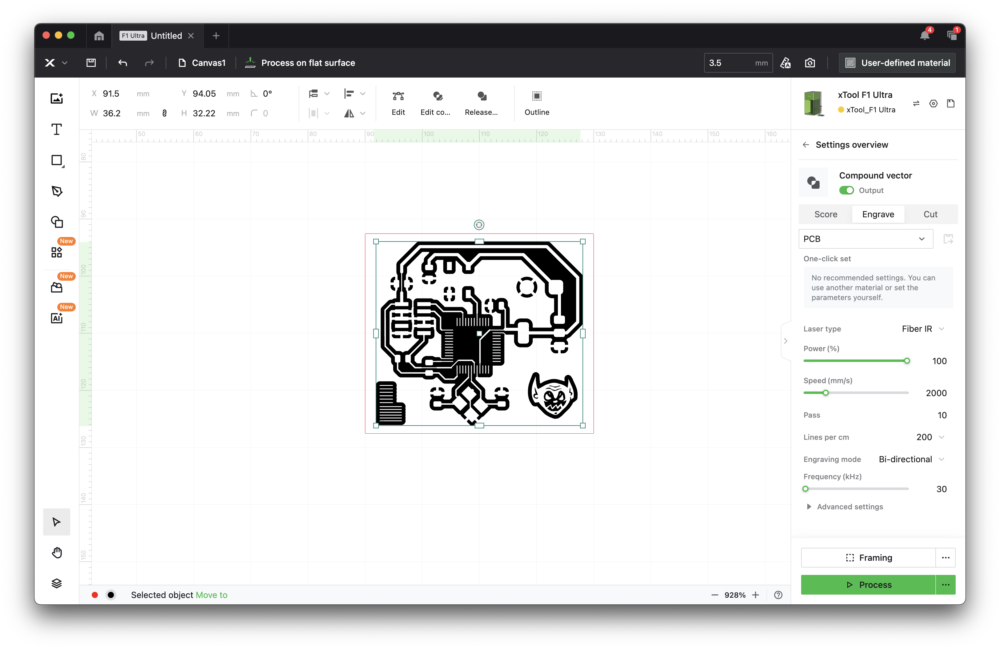
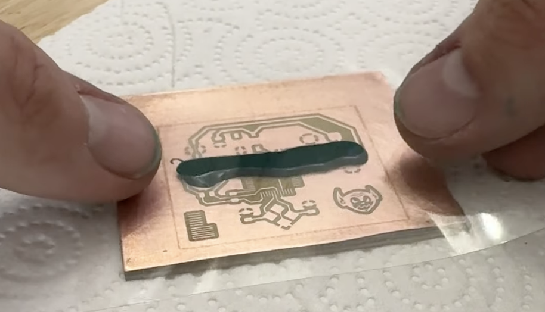

# How to make PCBs on a Fiber Laser

This repo contains instructions and settings for fabricating single-sided PCBs on an xTool F1 Ultra fiber laser.

## Parts Needed

Aside from the fiber laser, you'll need:

- A transparency sheet (or framed silkscreen)
- 600 grit sandpaper
- Scissors
- Soldermask
- FR1 Copper Clad Board
- Squeegee / scraper
- Isopropyl Alcohol

## File Prep

In order to have the xTool software correctly process your files, there's some specific settings for exporting your boad that will render the correct image.

1. In KiCAD, go to `File -> Plot`.
2. Switch `Plot Format` to "DXF." Only include the F.Cu layer. Under `DXF Options`, check `Plot graphic items using their contours` and `Export Units` to "Millimeters." Make sure you've selected "Edge.Cuts" under "Plot on All Layers" not shown in this screenshot, you'll have to scroll down. This will help with alignment later. Click the `Plot` button.

    

1. With the same settings, select only the `F.Mask` layer and click the `Plot` button.

    

## Removing Copper

1. Give your board a good sanding. While not strictly necessary, it helps quite a bit when inspecting the board and determining trace quality.

2. Mount the alignment bracket in the location that puts your board as close to the exact center of the work area as possible.

    

3. Pick the most square corner, and push it into the corner, making sure it does not come away from the bracket when pulling your hand away.

    

4. **Gently** slide down the cover, as to not disturb the board's position.

5. In xTool Create, import the front copper DXF you exported. It should look like the image below.

    

6. Select your imported design and select the `Ungroup` button

    

7. With the design components ungrouped, select the outer edge cuts line, right click, and move it to a different color. I choose red for this step

    

8. Select all the inner components of the design (I do this by selecting *all*, then shift-clicking the outer edge).

    

9.  Combine all of the inner design components by clicking the `Make Compound Vector` button.

    

10. With the center selected, select the `Engrave` option on the right, and the board should be filled in and look like the image below:

    

11. Import the `settings.json` file in this repository using the settings manager.

    
    

12. For the inner section, select the `Traces` settings. They're also shown below if you don't want to import them directly.

    

13. Use the "Capture Image" feature and the "Framing" feature to align your design onto the copper clad you put in the machine.

    

14. Run the job!

    

## Board Clean

1. Your board will have some flashing and burrs on the edge of the engravings. Use some 600 grit sandpaper to remove the rough edges. you should have a smooth, clean, copper result.

    
    

1. Clean your board with Isopropyl alcohol to remove any debris and dust.

## Apply Soldermask

1. Acquire UV curable solder mask. I recommend [Mechanic Solder Mask](https://amzn.to/3DEGndt). It cures well and applies easily.

    

1. Apply a bead across the board.

    

1. Place a transparency sheet on top.

    

1. Squeegee it as evenly as possible across the board.

    
    

1. An alternative solution is to use a [silkscreen frame](https://amzn.to/4fJWfZw). In my experience, this is a much more consistent way of applying the mask, and you get a nice matte finish after curing.

    
    

2. Cure the soldermask. A great, cheap solution is a UV nail polish curing station. [This one](https://amzn.to/3C092ZN) worked great for me.

    

## Removing Soldermask

1. Import the F.Mask DXF you exported.

    

1. Select all mask components, then combine them using the button along the top toolbar, and select the "engrave" job type in the menu on the right.

    

1. Then right click and move it to orange.

    

1. Align the mask on top of the existing board.

    
    

1. Select the `RemoveSolderMask` settings for the orange design. They're also shown below if you don't want to import them directly.

    

2. Disable the inner copper etch, and enable the edge cuts and the remove mask.

1. Do your best to reindex the board into the bracket. Use the framing tool in xTool's software to check alignment.

3. Run the job!

    

    

## Cutting

13. Select the outer edge and select the `Cut` job type, and the `Cut/Drill` settings. They're also shown below if you don't want to import them directly.

    

## Done

